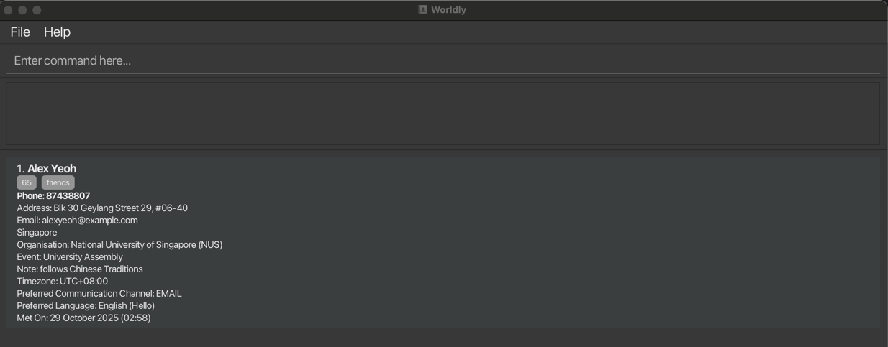
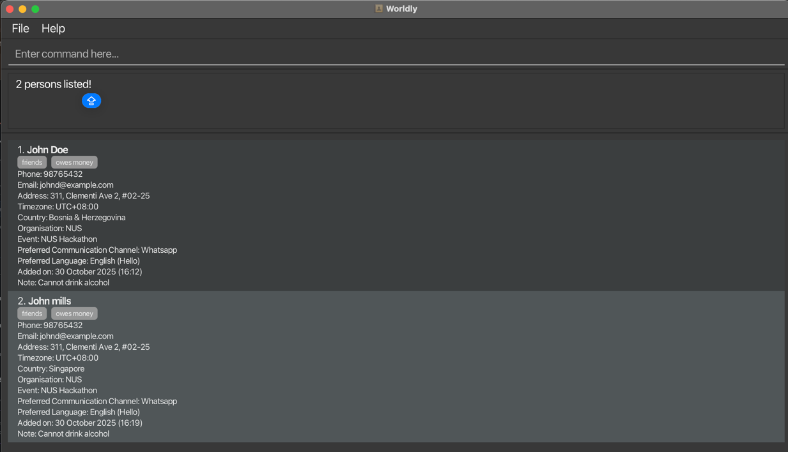
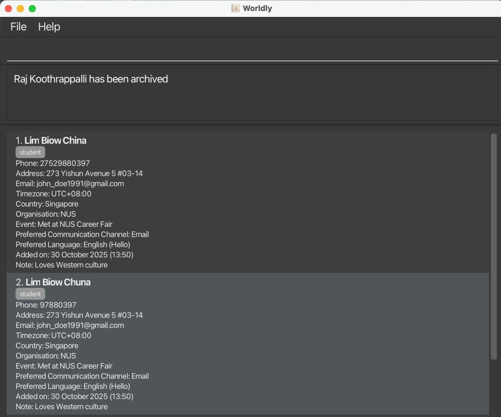
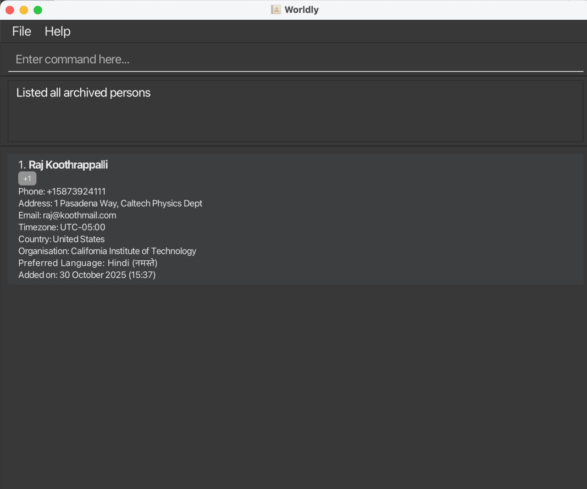

Worldly is a **desktop app for exchange students looking to manage their contacts**. It is optimized for use via a Command Line Interface (CLI) while still having the benefits of a Graphical User Interface (GUI). If you can type fast, Worldly will get your contact management tasks done faster than traditional GUI apps.

* Table of Contents
  {:toc}

--------------------------------------------------------------------------------------------------------------------

## :rocket: Quick Start

1. Ensure you have Java `17` or above installed on your Computer. 
   **Mac users only:** Ensure you have the precise JDK version prescribed [here](https://se-education.org/guides/tutorials/javaInstallationMac.html).

   **Tip:** You can check your installed Java version by typing `java -version` in your terminal. If it shows a version below 17, please install a newer JDK before running Worldly.
2. Download the latest `.jar` release from [here](https://github.com/se-edu/addressbook-level3/releases).
3. Copy the file to the folder you want to use as the _home folder_ for Worldly.
4. Open a command terminal (e.g., Terminal for Mac users) and navigate to the folder you put the jar file in with the commands below:
- `cd` (Windows) or `pwd` (Mac/Linux) to check the current folder path.
- `cd foldername` to enter a subfolder within the current folder. For example,`cd first\second` (Windows) or `cd first/second` (Mac/Linux) would enter a folder named "first", followed by a folder named "second" (located within "first").
- `cd ..` navigates to the previous folder.
5. Once you are in the folder that contains the jar file, use the `java -jar worldly.jar` command to run the application. 
    
   *Image: A GUI similar to the one above should appear in a few seconds. Note how the app contains a sample contact.*
6. Type your desired command in the command box and press the Enter key to execute it. For example, typing **`help`** and pressing Enter will open the help window. 
   Some example commands you can try:
- `list`: Lists all contacts.
- `add name:John Doe phone:98765432 email:johnd@example.com address:John street, block 123, #01-01 offset:+08:00`: Adds a contact named `John Doe` to the Address Book.
- `delete 3`: Deletes the third contact shown in the current list.
- `clear`: Deletes all contacts.
- `exit`: Closes the app.

 

Please refer to the **Commands** below for details of each command.

--------------------------------------------------------------------------------------------------------------------

## :star: Features

### Create new contacts
* Add up to 500 contacts with only 5 mandatory fields to start (name, phone number, email, address and offset)
* Edit contacts for details you may have initially left out
* Tag each contact with up to 10 custom tags
* Worldly automatically validates your contact details (like email, offset, and country) and will reject entries that don’t match the allowed format — so your contact list always stays clean.

### Organise your contact list
* Archive and unarchive contacts to hide them from the main list while keeping their details stored
* Sort contacts by name, country or date added

### Save and edit your data

Worldly's data is saved in the hard disk automatically after any command that changes the data, with no need to save manually.
The data is saved as a JSON file at `[JAR file location]/data/addressbook.json`. Advanced users are welcome to update data directly by editing that data file.

:exclamation: **Caution:**
If your changes to the data file render its format invalid, Worldly may behave in unexpected ways, potentially discarding all data and starting with an empty data file at the next run. It is therefore recommended to take a backup of the file before editing it.

--------------------------------------------------------------------------------------------------------------------

## :speech_balloon: Commands

**:information_source: Notes about the command format:** 

* Offset must be typed **immediately after the prefix**.
   
  e.g., `offset: +08:00` will not work, but `offset:+08:00` will.

* `UPPER_CASE` indicates the parameters to be supplied by the user. 
  e.g., In `add name:NAME`, `NAME` is a parameter which can be used as `add name:John Doe`.

* Parameters in square brackets are optional. 
  e.g.,`name:NAME [tag:TAG]` can be used as `name:John Doe tag:friend` or as `name:John Doe`.

* Parameters with `…`​ after them can be used multiple times, including not at all. 
  e.g., `[tag:TAG]...` can be used as ` ` (i.e. 0 times), `tag:friend`, `tag:friend tag:family` etc.

* Parameters can be in any order. 
  e.g., If the command specifies `name:NAME phone:PHONE_NUMBER`, `phone:PHONE_NUMBER name:NAME` is also acceptable.

* Extraneous parameters for commands that do not take in parameters (such as `help`, `list`, `exit` and `clear`) will be ignored. 
  e.g., If the command specifies `help 123`, it will be interpreted as `help`.

* If you are using a PDF version of this document, be careful when copying and pasting commands that span multiple lines as space characters surrounding line-breaks may be omitted when copied over to the application.

### Viewing the help menu: `help`

Shows the description and format of all actions a user can perform with Worldly, as well as the following in separate tabs:
* A table of valid country names for the `country:COUNTRY` field and their corresponding calling codes.
* A table of various regions and their timezones with respect to UTC for reference.
<!-- TO CHECK AGAIN -->
* A table of valid languages for the `language:LANGUAGE` field and a basic greeting in those languages.
* Shortcut: You can also open the help window by pressing `F1` or selecting *Help → User Guide* from the menu bar.

Format: `help`

### Adding a contact: `add`

Adds a contact to the address book.

Format: `add name:NAME phone:PHONE_NUMBER email:EMAIL address:ADDRESS offset:OFFSET [country:COUNTRY] [organisation:ORGANISATION] [event:EVENT] [channel:CHANNEL] [language: LANGUAGE] [note:NOTE] [tag:TAG]...`

* Do not include : in any field unless it follows the format. Doing so will cause an error.
<!-- TO CHECK AGAIN -->
* No duplicate names are allowed.
* A tag with the contact's country calling code is automatically added if the phone number starts with `+[COUNTRY CODE]`.
* Tags must be alphanumeric.
* The offset refers to the timezone offset with respect to UTC and must be specified in +/-HH:MM. You may refer to the help window (with `help`) for a reference table of offset values.
* The country field is **case-insensitive** but must match a country in the provided list (in `help`) **exactly**.
* The preferred communication channel field may be omitted, but if it is included, it **cannot be left blank**. The channel field is **case-insensitive** but you must specify one of the allowed channels: PHONE, EMAIL, SMS, WHATSAPP, or TELEGRAM.
* The language field is **case-insensitive** but must match a language in the provided list (in `help`) **exactly**.
* With the exceptions of the channel and tag fields, optional fields can be included and left blank (e.g., `country:`), which would have the same effect as omitting them from the command entirely.
* A contact can have up to 10 tags (including 0). Each tag must be added with `tag:`.
* There are limits to how long each field can be. They are as follows: 
  `name:`70 characters 
  `email:` 254 characters 
  `address:` 255 characters 
  `organisation:` 60 characters 
  `event:` 100 characters 
  `note:` 500 characters  
  `tag:` 30 characters per tag

 
<!-- To insert image -->

*Image: Before and after of an edit. Upon successfully adding a contact, you should see a confirmation message.*

Examples:
* `add name:John Doe phone:98765432 email:johnd@example.com address:John street, block 123, #01-01 offset:+08:00 country:Singapore channel: email note:does not drink alcohol tag:friends`
* `add name:Betsy Crowe phone:1234567 email:betsycrowe@example.com address:Newgate Prison offset:+08:00 channel:Telegram language:chinese tag:criminal tag:friend`

### Listing all contacts: `list`

Shows a list of all contacts in the address book. The list is sorted in alphabetical order of the contacts' names by default, but if a sort command was previously run (e.g., `sortdate`), it will follow the last requested order.

Format: `list`

### Editing a contact: `edit`

Edits an existing contact in the address book.

Format: `edit INDEX [name:NAME] [phone:PHONE] [email:EMAIL] [address:ADDRESS] [offset: OFFSET] [country:COUNTRY] [organisation:ORGANISATION][event:EVENT] [channel: CHANNEL] [language:LANGUAGE] [note:NOTE] [tag:TAG]...`

* Edits the contact at the specified `INDEX`. The index refers to the number shown in the currently displayed list beside the contact's name. The index must be a **positive integer**, i.e. 1, 2, 3...
* At least one of the optional fields must be provided.
* Existing values will be updated to the input values.
* When editing country, leaving the prefix blank (i.e. country:) will remove the existing country.
* When editing tags, the existing tags of the contact will be removed i.e adding of tags is not cumulative. You can remove all the contact’s tags by typing `tag:` without specifying any tags after it.
* If the currently viewed list is not the main list (e.g., if a `find` command was previously run), the index will refer to that of the **current list**, not the main list.
* If you accidentally mistype a prefix (e.g., `emails:` instead of `email:`), the app will notify you with an error message and show the correct usage format.

 
<!-- To insert image -->

*Image: Upon successfully editing a contact, you should see a confirmation message.*

Examples:
*  `edit 1 phone:91234567 email:johndoe@example.com` edits the phone number and email address of the first contact in the current list to be `91234567` and `johndoe@example.com` respectively.
*  `edit 2 name:Betsy Crower tag:` edits the name of the second contact in the current list to be `Betsy Crower` and clears all existing tags.

### Deleting a contact: `delete`

Deletes the specified contact from the address book.

Format: `delete INDEX`

* Deletes the contact at the specified `INDEX`.
* The index refers to the number shown beside a contact's name in the currently displayed list.
* The index **must be a positive integer**.

Examples:
* `list` followed by `delete 2` deletes the second contact in the address book.
* `find Betsy` followed by `delete 1` deletes the first contact in the results of the `find` command.

### Finding contacts by name: `find`

Finds contacts whose names contain any of the given keywords.

Format: `find KEYWORD [MORE_KEYWORDS]`

* The search is case-insensitive. e.g.,`hans` will match `Hans`.
* The order of the keywords does not matter. e.g., `Hans Bo` will match `Bo Hans`.
* Only the name is searched.
* Only full words will be matched e.g., `Han` will not match `Hans`.
* Contacts matching at least one keyword will be returned (i.e. `OR` search),
  e.g., `Hans Bo` will return `Hans Gruber`, `Bo Yang`.

Examples:
* `find John` returns `john` and `John Doe`
* `find alex david` returns `Alex Yeoh`, `David Li` 
  

### Finding contacts by country: `findcountry`

Finds contacts who are from the given country.

Format: `findcountry COUNTRY`

* The search is **case-insensitive**. e.g.,`Singapore` is a valid country, as well as `singapore` and `sinGApore`.
* Refer to the full list of valid country names in the help window.
  

Examples:
* `findcountry Singapore`

### Finding contacts by organisation: `findorganisation`

Finds contacts who are from the given organisation.

Format: `findorganisation ORGANISATION`

* The search is **case-sensitive**. e.g.,`NUS` will only return contacts that has `NUS` as their organisation, not `nus`.
* Refer to the full list of valid country names in the help window.
  

Examples:
* `findorganisation NUS`

### Finding contacts by tag: `findtag`

Finds contacts who are tagged with all of the given keywords.

Format: `findtag TAG [MORE_TAGS]`

* The search is **case-insensitive**.
* Only returns contacts who match ALL the tags.
* Only full words will be matched e.g., `friend` will not match `friends`.
  

Examples:
* `findtag friends`
* `findtag friends colleagues`

### Archiving a contact: `archive`

Archives the contact at the specified `INDEX` from the current list.

Format: `archive INDEX`

* Command format and function is similar to delete, except the contact is just moved to a separate list accessible
  with `archivelist` and can be unarchived at a later time.
* Displayed list will be main list (`list`) after archiving is done, regardless of previously applied filters (e.g., `find`).
  
  

 

*Image: By archiving NAME, the contact disappears from the main list. NAME can be found in the archive list, accessible with `archivelist`.*

Examples:
* `list` followed by `archive 2` archives the 2nd contact in the address book.

### Unarchiving a contact: `unarchive`

Unarchives the contact at the specified `INDEX` from the current list.

Format: `unarchive INDEX`

* Unarchives the contact at the specified `INDEX` from the current list, moving them back to the main list (`list`).
* Displayed list will be archive list (`archivelist`) after unarchiving is done, regardless of previously applied filters (e.g., `find`).
* As an exception to the previous point, unarchiving the last contact in the archive list will return the display to the main list instead.

Examples:
* `archivelist` followed by `unarchive 1` unarchives the first contact in the archive list.

### Listing all archived contacts: `archivelist`

Shows a list of all archived contacts in the address book.

Format: `archivelist`

### Sorting contacts by name: `sortname`

Sorts the contacts by alphabetical order of their names.

Format: `sortname`

* This is the default sorting order upon opening the app.

 
<!-- To insert image -->

*Image: An example of a sorted list can be seen above.*

### Sorting contacts by country: `sortcountry`

Sorts the contacts by country.

Format: `sortcountry`

* contacts are sorted in alphabetical order of their countries.
* Within each country, contacts are sorted in alphabetical order of their names.
* contacts without a country are pushed to the end of the list.
* After calling this command, contacts remain sorted by country upon calling other commands such as add or delete.
* Refer to the full list of valid country names in the help window.

### Sorting contacts by date: `sortdate`

Sorts the contacts by the date added.

Format: `sortdate`

* Functions similarly to sortcountry.

### Clearing all entries: `clear`

Clears all entries from the address book, **both in the main list and the archive**.

Format: `clear`

### Exiting the program: `exit`

Closes the program.

Format: `exit`

--------------------------------------------------------------------------------------------------------------------

## :question: FAQ

**Q**: How do I transfer my data to another computer? 
**A**: Install the app in the other computer and overwrite the empty data file it creates with the file that contains the data of your previous Worldly home folder.

 

**Q**: Can I sync Worldly between multiple computers? 
**A**: Worldly does not currently support automatic syncing. You must manually copy the `data/addressbook.json` file between computers.

 

**Q:** If I archive a contact, will it still appear in search results or when sorting? 
**A:** Yes, the `find` functions search the entire list of contacts, both archived and unarchived.

 

**Q:** Can I undo a command if I delete or edit a contact by mistake? 
**A:** Worldly does not currently have an undo feature. Deletions or edits are immediate, thus it is recommended to make periodic backups of `data/addressbook.json`.

--------------------------------------------------------------------------------------------------------------------

## :jigsaw: Known Issues

* **When using multiple screens**, if you move the application to a secondary screen, and later switch to using only the primary screen, the GUI will open off-screen. The remedy is to delete the `preferences.json` file created by the application before running the application again.
* **If you minimize the Help Window** and then run the `help` command (or use the `Help` menu, or the keyboard shortcut `F1`) again, the original Help Window will remain minimized, and no new Help Window will appear. The remedy is to manually restore the minimized Help Window.

--------------------------------------------------------------------------------------------------------------------

## :earth_asia: Command Summary

Action | Format and Examples
--------|------------------
**Help** | `help`
**Add** | `add name:NAME phone:PHONE_NUMBER email:EMAIL address:ADDRESS offset:OFFSET [country:COUNTRY] [organisation:ORGANISATION] [event:EVENT] [channel:CHANNEL] [language:LANGUAGE] [note:NOTE] [tag:TAG]...`   e.g., `add name:John Doe phone:98765432 email:johnd@example.com address:John street, block 123, #01-01 offset:+08:00 country:Singapore channel:email note:does not drink alcohol tag:friends`
**List** | `list`
**Edit** | `edit INDEX [name:NAME] [phone:PHONE_NUMBER] [email:EMAIL] [address:ADDRESS] [offset:OFFSET] [country:COUNTRY] [organisation:ORGANISATION] [event:EVENT] [channel:CHANNEL] [language:LANGUAGE] [note:NOTE] [tag:TAG]...`  e.g., `edit 2 name:James Lee email:jameslee@example.com`
**Delete** | `delete INDEX`  e.g., `delete 3`
**Find** | `find KEYWORD [MORE_KEYWORDS]`  e.g., `find James Jake`
**Find Country** | `findcountry COUNTRY`  e.g., `findcountry Singapore`
**Find Tag** | `findtag TAG [MORE_TAGS]`  e.g., `findtag friends`
**Find Organisation** | `findorganisation ORGANISATION`  e.g., `findorganisation Google`
**Archive** | `archive INDEX`  e.g., `archive 2`
**Unarchive** | `unarchive INDEX`  e.g., `unarchive 1`
**List Archived** | `archivelist`
**Sort by Name** | `sortname`
**Sort by Country** | `sortcountry`
**Sort by Date Added** | `sortdate`
**Clear** | `clear`
**Exit** | `exit`
